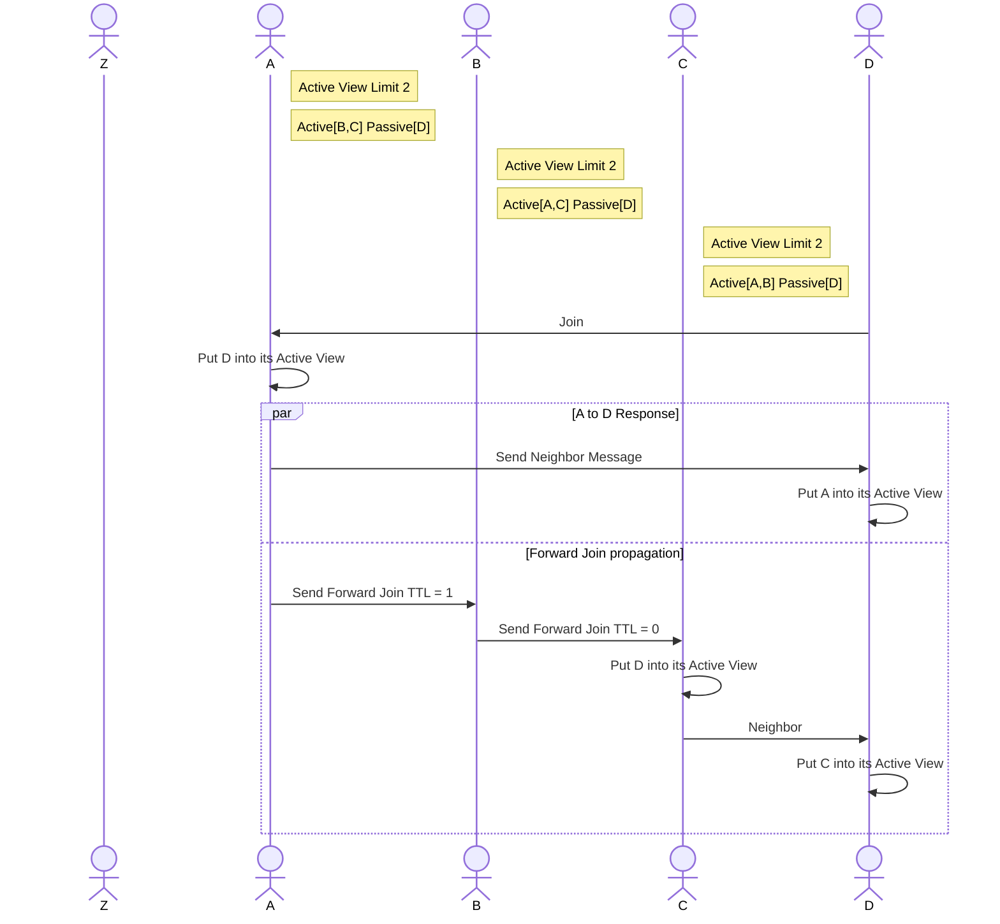

```mermaid
    sequenceDiagram

        actor Z
        actor A
        Note right of A : Active View Limit 2 
        Note right of A : Active[B,C] Passive[D]
        
        actor B
        Note right of B : Active View Limit 2
        Note right of B : Active[A,C] Passive[D]
        
        actor C
        Note right of C : Active View Limit 2
        Note right of C : Active[A,B] Passive[D]
        actor D
        
        D ->> A : Join
        A ->> A : Put D into its Active View
        
        par A to D Response
            A ->> D : Send Neighbor Message
            D ->> D : Put A into its Active View
        and Forward Join propagation
            A ->> B : Send Forward Join TTL = 1
            B ->> C : Send Forward Join TTL = 0
            C ->> C : Put D into its Active View
            C ->> D : Neighbor
            D ->> D : Put C into its Active View
        end
```
- 위 sequence diagram에서 `par`은 Parallel을 의미한다. 즉, `A to D Response`와 `Forward Join Propagation`은 동시에 일어나는 작업이다. 

